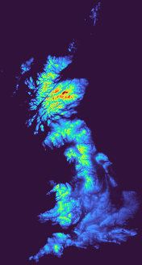

:f:prog:`test17`'s documentation
^^^^^^^^^^^^^^^^^^^^^^^^^^^^^^^^

:f:prog:`test17` is compiled by :download:`Makefile <../tests/Makefile>` and it can be run using :download:`run.sh <../tests/run.sh>`. The program uses :f:subr:`mod_safe/sub_allocate_array`, :f:subr:`mod_safe/sub_flood_array`, :f:subr:`mod_safe/sub_load_array_from_BIN`, :f:subr:`mod_safe/sub_save_array_as_PBM` and :f:subr:`mod_safe/sub_save_array_as_PPM`. The correct output should be:

.. f:autoprogram:: test17
