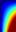

### Test Notes

This directory contains some basic tests to (hopefully):

* find any simple bugs that I might have introduced; and
* demonstrate some simple programming techniques.

The [Makefile](Makefile) and [run.sh](run.sh) script assume that "gfortran" and "openmpi" are being used via the commands `mpif90` and `mpirun`.

#### test01

[test01](test01.F90) is compiled by [Makefile](Makefile) and it can be run using [run.sh](run.sh). Each MPI task will use ~2.3 GiB of RAM. The program uses [sub_allocate_array](../mod_safe/sub_allocate_array) and [sub_bcast_array](../mod_safe_mpi/sub_bcast_array). The correct output should be:

```
Does MPI task 0 of 2 think that everything worked? T
Does MPI task 1 of 2 think that everything worked? T
```

Of course, the ordering of those two lines cannot be relied upon.

#### test02

[test02](test02.F90) is compiled by [Makefile](Makefile) and it can be run using [run.sh](run.sh). Each MPI task will use ~2.3 GiB of RAM. The program uses [func_overall_index](../mod_safe/func_overall_index), [sub_allocate_array](../mod_safe/sub_allocate_array) and [sub_allreduce_array](../mod_safe_mpi/sub_allreduce_array); it is a good demonstration of how to do some simple manual work sharing. The correct output should be:

```
Does MPI task 0 of 2 think that everything worked? T
Does MPI task 1 of 2 think that everything worked? T
```

Of course, the ordering of those two lines cannot be relied upon.

#### test03

[test03](test03.F90) is compiled by [Makefile](Makefile) and it can be run using [run.sh](run.sh). The program uses three [consts](../mod_safe/consts.f90); it is a simple demonstration of floating-point arithmetic. The correct output should be:

```
Does the task think that everything worked? T
```

#### test04, test05, test06 and test07

All four programs calculate the number "pi" in a rather silly way: the programs are merely examples of different types of parallelism.

| Program              | Overall Strategy | Main Program | Called Function |
|:--------------------:|:----------------:|:------------:|:---------------:|
| [test04](test04.F90) | serial           | serial       | serial          |
| [test05](test05.F90) | MPI only         | MPI          | serial          |
| [test06](test06.F90) | OpenMP only      | serial       | OpenMP          |
| [test07](test07.F90) | MPI+OpenMP       | MPI          | OpenMP          |

All four programs are compiled by [Makefile](Makefile) and they can be run using [run.sh](run.sh). All four programs use a [const](../mod_safe/consts.f90) and [sub_allocate_array](../mod_safe/sub_allocate_array); the two programs that use MPI also use [sub_allreduce_array](../mod_safe_mpi/sub_allreduce_array). As all four programs use random numbers the output is not repeatable. The correct output for the first program should be something like:

```
How does real pi compare to calculated pi? real = 3.141592654; calc = 3.156000000
```

Whereas the correct output for the second program should be something like:

```
For MPI task 0 of 4, how does real pi compare to calculated pi? real = 3.141592654; calc = 3.132000000
For MPI task 1 of 4, how does real pi compare to calculated pi? real = 3.141592654; calc = 3.164000000
For MPI task 2 of 4, how does real pi compare to calculated pi? real = 3.141592654; calc = 3.100000000
For MPI task 3 of 4, how does real pi compare to calculated pi? real = 3.141592654; calc = 3.148000000
Overall, how does real pi compare to calculated pi? real = 3.141592654; calc = 3.136000000
```

Whereas the correct output for the third program should be something like:

```
How does real pi compare to calculated pi? real = 3.141592654; calc = 3.153000000
```

Whereas the correct output for the fourth program should be something like:

```
For MPI task 0 of 4, how does real pi compare to calculated pi? real = 3.141592654; calc = 3.141000000
For MPI task 1 of 4, how does real pi compare to calculated pi? real = 3.141592654; calc = 3.147000000
For MPI task 3 of 4, how does real pi compare to calculated pi? real = 3.141592654; calc = 3.108000000
For MPI task 2 of 4, how does real pi compare to calculated pi? real = 3.141592654; calc = 3.129000000
Overall, how does real pi compare to calculated pi? real = 3.141592654; calc = 3.131250000
```

Of course, the ordering of the lines from the programs that use MPI cannot be relied upon.

#### test08

[test08](test08.F90) is compiled by [Makefile](Makefile) and it can be run using [run.sh](run.sh). The program uses [func_integrate_array](../mod_safe/func_integrate_array) and [sub_allocate_array](../mod_safe/sub_allocate_array). The correct output should be:

```
Does the task think that everything worked? T
Does the task think that everything worked? T
```

#### test09

[test09](test09.F90) is compiled by [Makefile](Makefile) and it can be run using [run.sh](run.sh). The program uses [sub_allocate_array](../mod_safe/sub_allocate_array) and [sub_save_array_as_PBM](../mod_safe/sub_save_array_as_PBM). The correct output should be:


#### test10

[test10](test10.F90) is compiled by [Makefile](Makefile) and it can be run using [run.sh](run.sh). The program uses [sub_allocate_array](../mod_safe/sub_allocate_array) and [sub_save_array_as_PGM](../mod_safe/sub_save_array_as_PGM). The correct output should be:


#### test11

[test11](test11.F90) is compiled by [Makefile](Makefile) and it can be run using [run.sh](run.sh). The program uses [sub_allocate_array](../mod_safe/sub_allocate_array) and [sub_save_array_as_PPM](../mod_safe/sub_save_array_as_PPM). The correct output should be:





#### test12

[test12](test12.F90) is compiled by [Makefile](Makefile) and it can be run using [run.sh](run.sh). The program uses [func_interpolate_points](../mod_safe/func_interpolate_points). The correct output should be:

```
Does the task think that everything worked? T
Does the task think that everything worked? T
```

#### test13

[test13](test13.F90) is compiled by [Makefile](Makefile) and it can be run using [run.sh](run.sh). The program uses [sub_solve_quadratic_equation](../mod_safe/sub_solve_quadratic_equation). The correct output should be:

```
Does the task think that everything worked? T
```

#### test14

[test14](test14.F90) is compiled by [Makefile](Makefile) and it can be run using [run.sh](run.sh). The program uses [sub_calc_loc_from_loc_and_bearing_and_dist](../mod_safe/sub_calc_loc_from_loc_and_bearing_and_dist.f90). The correct output should be:

```
How does Python compare to FORTRAN?
     Python =   30.820072345;   44.013665464;   67.257390656
    FORTRAN =   30.820072345;   44.013665464;   67.257390656
How does Python compare to FORTRAN?
     Python = -153.457744125;   13.966090288;   87.849219513
    FORTRAN = -153.457744125;   13.966090288;   87.849219513
```

#### test15

[test15](test15.F90) is compiled by [Makefile](Makefile) and it can be run using [run.sh](run.sh). The program uses [func_mean](../mod_safe/func_mean.f90), [func_var](../mod_safe/func_var.f90), [func_stddev](../mod_safe/func_stddev.f90), [func_stderr](../mod_safe/func_stderr.f90) and [sub_ttest_ind](../mod_safe/sub_ttest_ind.f90).
